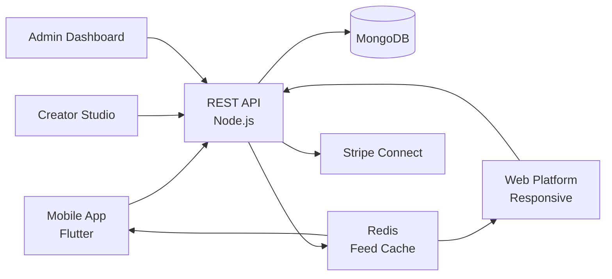

# Twitter Clone — White-Label Social Network & Microblogging Platform by Miracuves

**MXTweet** is a production-ready, white-label Twitter clone: a complete social network with feeds, threads, DMs, and creator monetization — delivered with **100% source code ownership** in **6 working days**.

> 🐦 **See it running before you talk to anyone.** Live iOS, Android, web, and admin console — demo credentials are printed on the [solution page](https://miracuves.com/twitter-clone#demo). No sales call required.

---

## 🚀 Live Demos

| Environment | URL | What you can test |
|---|---|---|
| 📱 Mobile App | [mas.mimeld.com](https://mas.mimeld.com) | Post, like, reply, repost, follow, DM |
| 🌐 Web Platform | [mxtweet.mimeld.com](https://mxtweet.mimeld.com) | Full social experience in the browser |
| 🛡️ Moderation Console | [Solution page → Demo](https://miracuves.com/twitter-clone#demo) | User reports, content takedowns, ad reviews |
| 🛠️ Admin Dashboard | [Solution page → Demo](https://miracuves.com/twitter-clone#demo) | Users, content, ads, analytics, payouts |

Demo credentials for all environments: **[miracuves.com/twitter-clone → Demo section](https://miracuves.com/twitter-clone/#demo)**

---

## ✨ What Makes This Twitter Clone Different

Most social-network scripts stop at "post + like." This platform ships with the features that actually run a social *business*:

- **Algorithmic + Chronological Toggle** — one-tap switch between "For You" and "Following" — same engine that became X's most-requested feature
- **Federated Identity Ready** — ActivityPub support built in so your network can talk to Mastodon / Threads / Bluesky — future-proof against walled gardens
- **Spaces & Live Audio** — built-in audio rooms with raise-hand, host controls, recording, and clipping — same feature Twitter Spaces launched with
- **Tip Jar & Subscriptions** — creators monetize directly without giving a cut to ad networks — built-in Stripe Connect integration
- **Trust & Safety Stack** — AI moderation + human review queue + user reporting pipeline + transparent policy enforcement — production-grade from day one

## 📦 Core Features

**User:** post / repost / quote · threads · polls · lists · bookmarks · DMs · spaces · multi-media · privacy controls

**Creator:** monetization subscriptions · tips · analytics dashboard · audience insights · pinned posts · verified badge

**Admin:** user management · content moderation · ad placement · trend analytics · compliance reporting · payouts

## 🏗️ Architecture

**Stack:** Flutter mobile apps (Android + iOS) · Node.js backend · MongoDB for posts & timelines · Redis for feed ranking · S3 for media · Stripe Connect for creator payouts, regional gateways

## 📋 What’s Included

- ✅ Full source code — backend, web, mobile apps, panels (no encryption, no license locks)
- ✅ Deployment to your servers & app store submission assistance
- ✅ Your branding — white-label rename, logo, colors, domain
- ✅ 60 days post-launch support + 12 months of free updates
- ✅ Documentation & handover

**Pricing:** from **$6,399**, transparent on the [solution page](https://miracuves.com/twitter-clone/#pricing) — no "contact us for quote" games.

## 🆚 Why Not Build From Scratch?

Custom social platforms run $80k–$400k and 5–9 months. A proven white-label base gets you to market in 6 working days for a fraction of that, with your budget preserved for growth marketing and creator outreach.

## 📚 Resources

- 📖 [Twitter Clone — Full Solution Page](https://miracuves.com/twitter-clone) (features, pricing, demos, FAQ)
- 💰 [How Much Does a Social Network App Cost in 2026?](https://miracuves.com/twitter-clone#pricing) pricing breakdown & what's included
- 📝 [Best Twitter Clone Script in 2026](https://miracuves.com/twitter-clone/blog/) features, pricing & launch guide
- 🧠 [Why Federated Networks Are the Future of Social](https://miracuves.com/twitter-clone/blog/) ActivityPub & the open social graph
- ✅ [Miracuves Facts & Claims Ledger](https://miracuves.com/twitter-clone/facts/) every claim we make, verified

## 🏢 About Miracuves

[Miracuves Solutions](https://miracuves.com) builds white-label clone apps and custom software from Mumbai, India — 90+ ready-made solutions, live demos for every product, transparent pricing, and delivery in 6 working days. Operating since 2010.

**Talk to us:** [WhatsApp](https://wa.me/919830009649) · [Schedule a consultation](https://miracuves.com/schedule-consultation/) · [miracuves.com](https://miracuves.com)

---

### ⚠️ Note on This Repository

This repository is a product overview. The full source code is delivered to clients on purchase — see [what’s included](https://miracuves.com/twitter-clone/#included). For a hands-on evaluation, use the live demos above; credentials are public on the solution page.

*Keywords: twitter clone, twitter clone script, social network, microblogging, white label social, creator monetization, Flutter social app, Node.js social platform*

---

<!--
══════════════════════════════════════════════════
TEMPLATE VARIABLE KEY — auto-generated from Netflix-Clone pattern
══════════════════════════════════════════════════
{APP_NAME}        Twitter Clone
{MX_NAME}         MXTweet
{CATEGORY}        Social Network & Microblogging Platform
{DEMO_WEB}        mxtweet.mimeld.com
{PRICE}           $6,399
{SLUG}            twitter-clone
{SOLUTION_URL}    https://miracuves.com/twitter-clone/
{VERTICAL}        social_micro

See /tmp/verticals/social_micro.txt for the vertical config used to generate this README.
══════════════════════════════════════════════════
-->